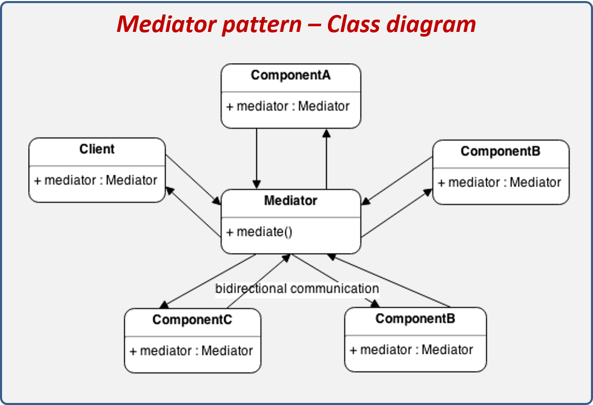
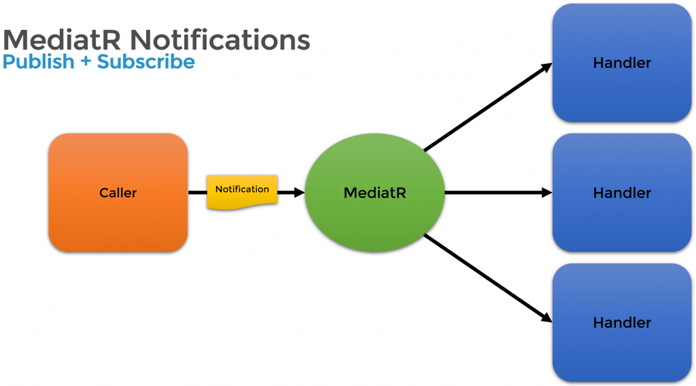

.Net Core MediatR Sample
========================

Simple mediator implementation in .NET

In-process messaging with no dependencies.

Supports request/response, commands, queries, notifications and events, synchronous and async with intelligent dispatching via C# generic variance.

- Mediator Pattern 

    
     

- MediatR

    

References :
------------
[MediatR wiki.](https://github.com/jbogard/MediatR/wiki)
  
[MediatR with NuGet:](https://www.nuget.org/packages/MediatR)
 
[wikipedia.org](https://en.wikipedia.org/wiki/Mediator_pattern#:~:text=In%20software%20engineering%2C%20the%20mediator,often%20consist%20of%20many%20classes.)
 
[refactoring.guru](https://refactoring.guru/design-patterns/mediator)
 
[dofactory.com](https://www.dofactory.com/net/mediator-design-pattern)